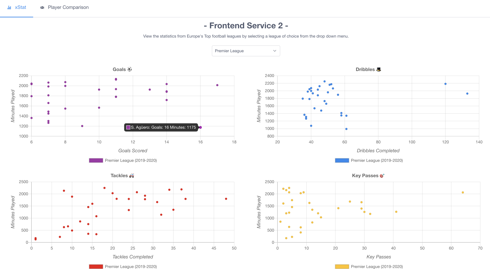
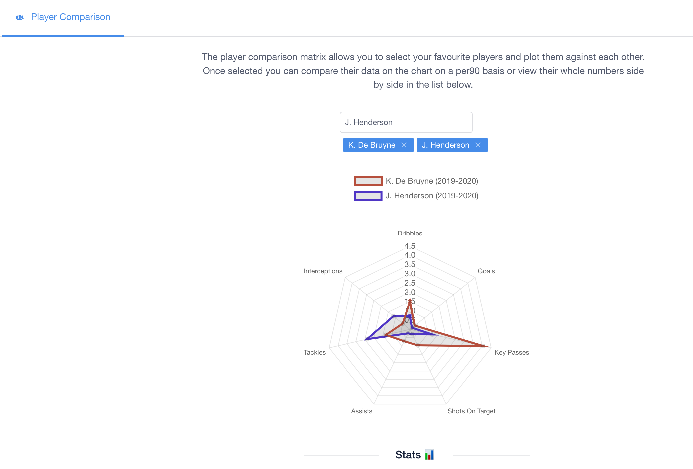
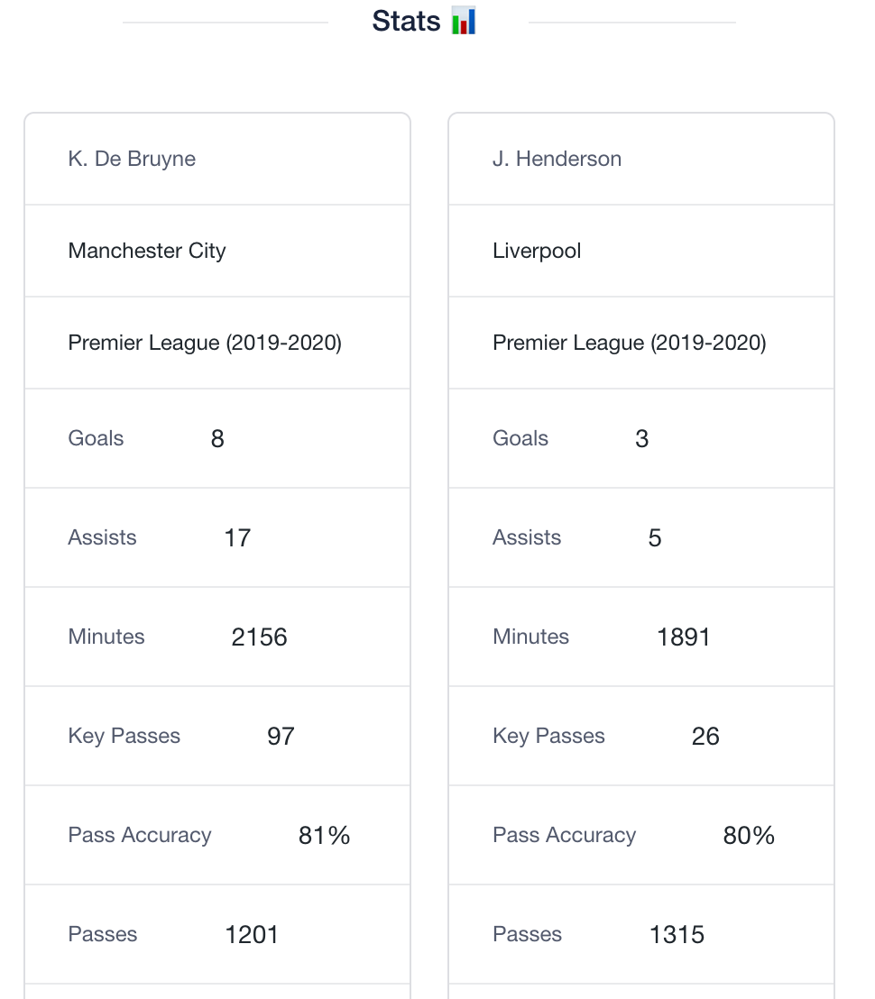

# xStat 
Data visualization platform for football player statistics using micro-services.

## Home page
- Charts wiil update on change of league selected via drop down

 

## Player comparison matrix
- Add up to 2 players from any of Europes top 5 football leagues 

 

## Whole number stats for selected players
- Side by side panel view of plotted players for a better grasp of their stats

 

## Stack
- General service: Python (Flask)
- Player Comparison Service: Python (Flask)
- Frontend Service: JavaScript (Vue.js)

## Postman documentation for services
- (GET) curl https://www.postman.com/collections/8909f69b123bac005d9a

## Run 
- Install Docker
- Run the application: docker-compose up
- Visit http://localhost:8084 or http://localhost:8080

- Kill application: docker-compose down
